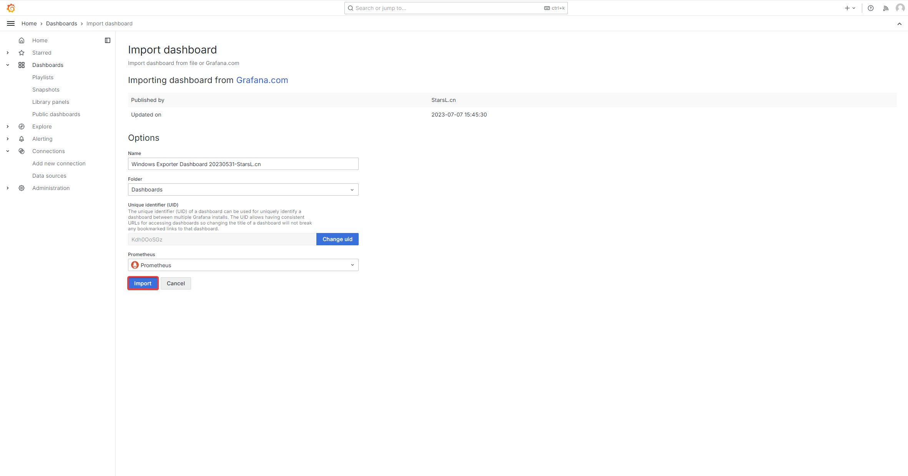

# 简介

单体式架构

- Spring Boot
- Filter（安全验证过滤器）
- MyBatis Plus
- Redis
- MinIO

# 项目结构

```text
├ monolithic
├── util      （工具模块）
├── biz       （业务模块）
├── web       （Web模块）
├── websocket （WebSocket模块）
└── scheduler （任务调度模块）
```

# 接口文档

[Swagger](http://localhost:8000/swagger-ui/index.html)

[Knife4j](http://localhost:8000/doc.html)

# 监控

Prometheus + Grafana + Alertmanager

## Prometheus

`/prəˈmiː.θi.əs/`

### 简介

[官网](https://prometheus.io)

Prometheus 是一个开源项目，旨在深入挖掘我们的应用程序数据，通过创建过滤层来收集和分析从最简单到最复杂的所有内容。 它不仅仅关乎数字和图表，而且通过其高级查询语言和时间序列数据能力，帮助我们理解应用程序的运行状况。 集成 Prometheus 使我们能够在问题发生之前就发现问题，对系统进行微调，确保应用程序以最佳性能运行，最终为用户带来更好的体验 - 方便、快捷、可靠。

### 安装

- 下载地址

https://prometheus.io/download

`prometheus-2.53.0-rc.0.windows-amd64.zip`

- prometheus.yml

```yml
# my global config
global:
  scrape_interval: 15s # Set the scrape interval to every 15 seconds. Default is every 1 minute.
  evaluation_interval: 15s # Evaluate rules every 15 seconds. The default is every 1 minute.
  # scrape_timeout is set to the global default (10s).

# Alertmanager configuration
alerting:
  alertmanagers:
    - static_configs:
        - targets:
          # - alertmanager:9093

# Load rules once and periodically evaluate them according to the global 'evaluation_interval'.
rule_files:
# - "first_rules.yml"
# - "second_rules.yml"

# A scrape configuration containing exactly one endpoint to scrape:
# Here it's Prometheus itself.
scrape_configs:
  # The job name is added as a label `job=<job_name>` to any timeseries scraped from this config.
  - job_name: "prometheus"

    # metrics_path defaults to '/metrics'
    # scheme defaults to 'http'.

    static_configs:
      - targets: [ "localhost:9090" ]
```

- Web

[首页](http://localhost:9090)

[查看监控对象列表](http://localhost:9090/targets)

### exporter

#### windows_exporter

监控 Windows 系统

- 安装 windows_exporter

https://github.com/prometheus-community

https://github.com/prometheus-community/windows_exporter/releases/tag/v0.26.0-rc.2

`windows_exporter-0.26.0-amd64.msi`

- Prometheus 配置

prometheus.yml

```yml
scrape_configs:
  - job_name: 'Windows'
    static_configs:
      # windows_exporter 默认运行端口是 9182
      - targets: [ 'localhost:9182' ]
```

#### mysqld_exporter

https://github.com/prometheus/mysqld_exporter

监控 MySQL 关系型数据库

- 安装 mysqld_exporter

https://prometheus.io/download

`mysqld_exporter-0.15.1.windows-amd64.zip`

- mysqld_exporter 配置

添加 `.my.cnf` 文件

```cnf
[client]
host=localhost
port=3306
user=root
password=root
```

- Prometheus 配置

prometheus.yml

```yml
scrape_configs:
  - job_name: 'MySQL'
    static_configs:
      # mysqld_exporter 默认运行端口是 9104
      - targets: [ 'localhost:9104' ]
```

#### redis_exporter

监控 Redis 非关系型数据库


#### SpringBoot 集成 Prometheus

监控 SpringBoot 应用

- SpringBoot 配置

https://springdoc.cn/spring-boot-prometheus

首先，将 Spring Boot Actuator 和 Micrometer Prometheus Registry 添加到项目的依赖中。 Actuator 提供了一系列内置端点，用于显示运行应用的性能信息，如健康状况、指标等。 Micrometer Prometheus registry 会将这些指标格式化为 Prometheus 可读格式。

pom.xml

```xml
<?xml version="1.0" encoding="UTF-8"?>
<project>
    <dependencies>
        <dependency>
            <groupId>io.micrometer</groupId>
            <artifactId>micrometer-registry-prometheus</artifactId>
        </dependency>
        <dependency>
            <groupId>org.springframework.boot</groupId>
            <artifactId>spring-boot-starter-actuator</artifactId>
        </dependency>
    </dependencies>
</project>
```


application.yml

```yml
management:
  endpoints:
    web:
      exposure:
        include: '*'
  endpoint:
    health:
      show-details: always
```

这个配置确保 Actuator 暴露 `/actuator/prometheus` 端点，该端点以 Prometheus 可以抓取的格式提供了丰富的应用指标。 需要注意的是，公开所有的 Actuator 端点（`management.endpoints.web.exposure.include=*`）在开发过程中可以提供有用的洞察力，但可能会暴露敏感的运行数据。对于生产环境，最佳实践是根据监控和运营需求慎重地选择要公开的端点。

通过上述这些步骤，我们的 Spring Boot 应用现在将公开有价值的指标，供 Prometheus 收集和存储。这个基础设置对于我们监控策略的下一阶段非常关键，包括使用 Prometheus 抓取这些指标，并使用 Grafana 等工具进行可视化展示。

- Prometheus 配置

prometheus.yml

```yml
scrape_configs:
  - job_name: 'Monolithic Web'
    metrics_path: '/actuator/prometheus'
    scrape_interval: 15s
    static_configs:
      - targets: [ 'localhost:8000' ]
    bearer_token: 'kiiI6IkphFra!NUB4iLCJpYXQN^LRXN~Xo@4a1hMWF%y1hNGYODLT0skjM1u2?nKzIiWunf!Z3FpInYkYNW1Y&U'
```

## Grafana

### 简介

[官网](https://grafana.com)

### 安装

- 下载地址

https://grafana.com/grafana/download

`grafana-enterprise-11.0.0.windows-amd64.zip`

`bin/grafana-server.exe`

- grafana-v11.0.0/conf/defaults.ini

功能模块分布

| 功能 | 配置文件中模块 |
| --- | --- |
| 登录用户名/密码 | \[security\] |
| 用户管理 | \[users\] |
| 匿名登录 | \[auth.anonymous\] |
| 邮件配置 | \[smtp\] |

```ini

```

- Web

[首页](http://localhost:3000)

用户名：admin
密码：admin

### 添加 Prometheus 数据源

- 添加数据源


- 添加 Windows 仪表板

https://grafana.com/grafana/dashboards

搜索：windows

仪表板ID：10467





- 添加 MySQL 仪表板

https://grafana.com/grafana/dashboards

搜索：MySQL

`MySQL Overview`仪表板ID：7362

`MySQL Monitor`仪表板ID：9342


- 添加 Redis 仪表板


- 添加 SpringBoot 仪表板

https://grafana.com/grafana/dashboards

搜索：SpringBoot

`SpringBoot APM Dashboard`仪表板ID：12900

`SpringBoot APM Dashboard（中文版本）`仪表板ID：21319


## Alertmanager

### 简介


### 安装

- 下载地址

https://prometheus.io/download

`alertmanager-0.27.0.windows-amd64.zip`

`alertmanager.exe`

- Web

[首页](http://localhost:9093)


- 关联 Prometheus 与 Alertmanager

在 Prometheus 的架构中被划分成两个独立的部分。 Prometheus 负责产生告警，而 Alertmanager 负责告警产生后的后续处理。 因此 Alertmanager 部署完成后，需要在 Prometheus 中设置 Alertmanager 相关的信息。

prometheus.yml

```yml
# Alertmanager configuration
alerting:
  alertmanagers:
    - static_configs:
        - targets: ['localhost:9093']
```

重启 Prometheus 服务，成功后，可以从 http://localhost:9090/config 查看 alerting 配置是否生效。


### 与 SMTP 邮件集成

alertmanager.yml

```yml
global:
  # 邮件SMTP服务器地址和端口
  smtp_smarthost: 'smtp.example.com:25'
  # 发件人邮箱地址
  smtp_from: 'your-email@example.com'
  # 用户名
  smtp_auth_username: 'your-email@example.com'
  # 密码或授权码
  smtp_auth_password: 'your-email-password'
  # 是否要求TLS加密
  #smtp_require_tls: true

# 路由
route:
  # 定义警报事件的分组方式
  # 可以使用警报标签（例如 job、severity）作为分组依据，将具有相同标签值的警报事件分为一组
  # 这样可以更好地组织和聚合警报事件，避免过多的重复通知
  group_by: ['alertname']
  # 指定在发送第一个通知后，等待其他警报事件加入相同组的时间
  # 如果在此期间有新的警报事件加入到组中，则会在等待时间结束后发送一次聚合通知
  group_wait: 30s
  # 定义在发送聚合通知后，再次发送相同组警报事件的间隔时间
  # 可以控制聚合通知的频率，避免频繁发送通知
  group_interval: 5m
  # 指定在发送聚合通知后，再次发送通知的间隔时间
  # 与 group_interval 不同，repeat_interval 控制的是非聚合通知的重复发送间隔
  repeat_interval: 1h
  # 指定接收警报事件的通知接收器
  # 可以配置多个接收器，并根据需要选择其中一个或多个接收器来处理警报事件
  # 通常，接收器可以是电子邮件、PagerDuty、Slack 等通知渠道
  receiver: 'email-receiver'

# 接收器
receivers:
  - name: 'email-receiver'
    email_configs:
      # 收件人邮箱地址
      - to: 'recipient@example.com'
```

### 告警

- SpringBoot 离线告警

prometheus.yml

```yml
# Load rules once and periodically evaluate them according to the global 'evaluation_interval'.
rule_files:
  - alert.rules.yml
```

alert.rules.yml

```yml
groups:
  - name: example
    rules:
      # 告警规则的名称
      - alert: InstanceDown
        # 基于PromQL表达式告警触发条件，用于计算是否有时间序列满足该条件
        expr: up == 0
        # 评估等待时间，可选参数
        # 用于表示只有当触发条件持续一段时间后才发送告警，在等待期间新产生告警的状态为 pending
        for: 1m
        # 自定义标签，允许用户指定要附加到告警上的一组附加标签
        labels:
          severity: critical
        # 用于指定一组附加信息，比如用于描述告警详细信息的文字等，annotations 的内容在告警产生时会一同作为参数发送到 Alertmanager
        annotations:
          summary: "Instance {{ $labels.instance }} down"
          description: "{{ $labels.instance }} of job {{ $labels.job }} has been down for more than 1 minute."
```

[查看路由信息](http://localhost:9090/rules)

