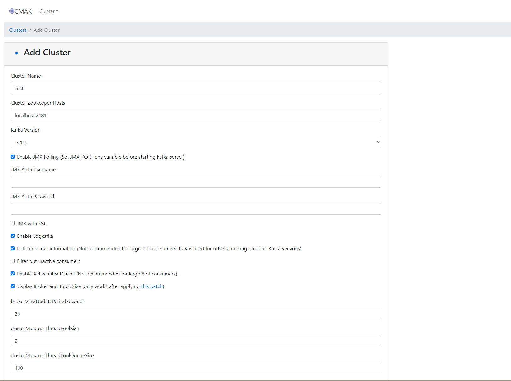

# 前言

生产者（Producer）和消费者（Consumer）是计算机科学中常见的概念，通常用于描述在消息传递系统中的角色和行为。 在消息队列系统（如Kafka、RabbitMQ等）或者并发编程中，生产者和消费者模式是一种重要的设计模式，用于解耦消息的发送和接收，以实现系统的可扩展性和灵活性。

生产者和消费者模式的优势：

- 解耦性: 生产者和消费者之间通过消息队列进行通信，相互解耦，提高了系统的灵活性和可维护性。
- 异步处理: 生产者可以异步地生成消息，而消费者可以异步地处理消息，有效提升系统整体的并发处理能力。
- 削峰填谷: 可以根据实际需求动态调整生产者和消费者的速率，以应对高峰期和低谷期的需求波动。

实际应用：

- 日志处理系统: 应用程序通过生产者将日志消息发送到中心化的日志系统，消费者从中获取日志并进行分析或者存储。
- 消息队列系统: 如 Kafka、RabbitMQ 等，通过生产者发送消息到队列，消费者从队列中获取消息进行处理。
- 并发编程: 在多线程环境中，使用生产者和消费者模式来管理线程间的消息传递和任务处理。

# 简介

生产者（Producer）是消息队列中负责产生消息并发送到队列的组件或者角色。其主要功能包括：

- 生成消息: 根据业务逻辑生成需要传输的消息。
- 发送消息: 将生成的消息发送到消息队列的特定 topic 或者队列中。
- 消息确认: 确保消息成功发送，或者在失败后进行重试或者记录异常。
- 性能优化: 可以进行批量发送、消息压缩等优化操作，提高系统性能和吞吐量。

# 安装

- 下载

https://kafka.apache.org/downloads

`3.7.0`

`kafka_2.13-3.7.0.tgz`

- Zookeeper 配置

config/zookeeper.properties

```properties
dataDir=/tmp/kafka/zookeeper
```

- Kafka Broker 配置

config/server.properties

```properties
log.dirs=/tmp/kafka/log
```

- 启动 Zookeeper

```shell
./bin/zookeeper-server-start.sh ./config/zookeeper.properties
```

- 启动 Kafka 服务器

```shell
./bin/kafka-server-start.sh ./config/server.properties
```

# Kafka Manager

Kafka Manager 是一个功能强大的开源 Kafka 管理和监控工具，由 Yahoo 开发和维护。它提供了广泛的集群管理功能，包括主题、分区、消费者组的管理，以及一些高级功能如分区重分配工具等。

https://github.com/yahoo/CMAK

- 下载

https://github.com/yahoo/CMAK/releases

`cmak-3.0.0.6.zip`

- 配置

conf/application.conf

```conf
kafka-manager.zkhosts="localhost:2181"
cmak.zkhosts="localhost:2181"
```

- 启动

```shell
./cmak -Dconfig.file=./conf/application.conf
```

[long input string in cmak.bat #863](https://github.com/yahoo/CMAK/issues/863)

```batch
::删除此行：set "APP_CLASSPATH=%APP_LIB_DIR%\..\conf\;%APP_LIB_DIR%\cmak.cmak-3.0.0.6-sans-externalized.jar;%APP_LIB_DIR%\org.apache.commons.commons-lang3-3.6.jar;%APP_LIB_DIR%\org.apache.kafka.kafka-clients-2.4.1.jar;%APP_LIB_DIR%\javax.inject.javax.inject-1.jar;%APP_LIB_DIR%\com.fasterxml.jackson.core.jackson-core-2.10.0.jar;%APP_LIB_DIR%\com.fasterxml.jackson.datatype.jackson-datatype-jsr310-2.8.11.jar;%APP_LIB_DIR%\org.scalaz.scalaz-core_2.12-7.2.27.jar;%APP_LIB_DIR%\com.typesafe.play.play_2.12-2.6.21.jar;%APP_LIB_DIR%\io.netty.netty-codec-4.1.45.Final.jar;%APP_LIB_DIR%\com.yammer.metrics.metrics-core-2.2.0.jar;%APP_LIB_DIR%\com.fasterxml.jackson.datatype.jackson-datatype-jdk8-2.10.0.jar;%APP_LIB_DIR%\org.webjars.requirejs-2.3.5.jar;%APP_LIB_DIR%\org.apache.curator.curator-client-2.12.0.jar;%APP_LIB_DIR%\com.typesafe.play.play-functional_2.12-2.6.12.jar;%APP_LIB_DIR%\commons-codec.commons-codec-1.11.jar;%APP_LIB_DIR%\com.beachape.enumeratum-macros_2.12-1.5.9.jar;%APP_LIB_DIR%\javax.transaction.jta-1.1.jar;%APP_LIB_DIR%\io.netty.netty-transport-4.1.45.Final.jar;%APP_LIB_DIR%\org.webjars.popper.js-1.14.3.jar;%APP_LIB_DIR%\org.json4s.json4s-scalap_2.12-3.6.5.jar;%APP_LIB_DIR%\com.typesafe.play.play-server_2.12-2.6.21.jar;%APP_LIB_DIR%\org.apache.kafka.connect-json-2.2.0.jar;%APP_LIB_DIR%\org.slf4j.jul-to-slf4j-1.7.25.jar;%APP_LIB_DIR%\org.typelevel.macro-compat_2.12-1.1.1.jar;%APP_LIB_DIR%\org.reactivestreams.reactive-streams-1.0.2.jar;%APP_LIB_DIR%\com.typesafe.play.filters-helpers_2.12-2.6.21.jar;%APP_LIB_DIR%\com.fasterxml.jackson.core.jackson-annotations-2.10.0.jar;%APP_LIB_DIR%\ch.qos.logback.logback-classic-1.2.3.jar;%APP_LIB_DIR%\com.typesafe.play.play-streams_2.12-2.6.21.jar;%APP_LIB_DIR%\org.rocksdb.rocksdbjni-5.15.10.jar;%APP_LIB_DIR%\org.webjars.webjars-play_2.12-2.6.3.jar;%APP_LIB_DIR%\javax.activation.javax.activation-api-1.2.0.jar;%APP_LIB_DIR%\com.google.code.findbugs.jsr305-3.0.2.jar;%APP_LIB_DIR%\org.slf4j.jcl-over-slf4j-1.7.25.jar;%APP_LIB_DIR%\joda-time.joda-time-2.9.9.jar;%APP_LIB_DIR%\io.netty.netty-transport-native-epoll-4.1.45.Final.jar;%APP_LIB_DIR%\com.typesafe.play.build-link-2.6.21.jar;%APP_LIB_DIR%\com.github.luben.zstd-jni-1.4.3-1.jar;%APP_LIB_DIR%\org.apache.curator.curator-recipes-2.12.0.jar;%APP_LIB_DIR%\org.scala-lang.modules.scala-parser-combinators_2.12-1.1.1.jar;%APP_LIB_DIR%\io.netty.netty-buffer-4.1.45.Final.jar;%APP_LIB_DIR%\org.lz4.lz4-java-1.6.0.jar;%APP_LIB_DIR%\org.json4s.json4s-scalaz_2.12-3.6.5.jar;%APP_LIB_DIR%\com.typesafe.play.play-logback_2.12-2.6.21.jar;%APP_LIB_DIR%\org.apache.kafka.kafka-streams-2.2.0.jar;%APP_LIB_DIR%\com.google.guava.guava-23.6.1-jre.jar;%APP_LIB_DIR%\io.netty.netty-transport-native-unix-common-4.1.45.Final.jar;%APP_LIB_DIR%\org.scala-lang.scala-reflect-2.12.10.jar;%APP_LIB_DIR%\org.webjars.bootstrap-4.3.1.jar;%APP_LIB_DIR%\io.netty.netty-common-4.1.45.Final.jar;%APP_LIB_DIR%\com.typesafe.akka.akka-slf4j_2.12-2.5.19.jar;%APP_LIB_DIR%\com.typesafe.play.play-json_2.12-2.6.12.jar;%APP_LIB_DIR%\com.typesafe.play.play-netty-utils-2.6.21.jar;%APP_LIB_DIR%\io.netty.netty-resolver-4.1.45.Final.jar;%APP_LIB_DIR%\com.google.j2objc.j2objc-annotations-1.1.jar;%APP_LIB_DIR%\com.typesafe.akka.akka-http-core_2.12-10.0.15.jar;%APP_LIB_DIR%\org.webjars.json-20121008-1.jar;%APP_LIB_DIR%\org.json4s.json4s-ast_2.12-3.6.5.jar;%APP_LIB_DIR%\com.beachape.enumeratum_2.12-1.5.13.jar;%APP_LIB_DIR%\org.clapper.grizzled-slf4j_2.12-1.3.3.jar;%APP_LIB_DIR%\io.netty.netty-handler-4.1.45.Final.jar;%APP_LIB_DIR%\org.scala-lang.modules.scala-collection-compat_2.12-2.1.2.jar;%APP_LIB_DIR%\com.google.errorprone.error_prone_annotations-2.1.3.jar;%APP_LIB_DIR%\org.webjars.dustjs-linkedin-2.7.2.jar;%APP_LIB_DIR%\com.fasterxml.jackson.module.jackson-module-scala_2.12-2.10.0.jar;%APP_LIB_DIR%\commons-cli.commons-cli-1.4.jar;%APP_LIB_DIR%\com.typesafe.play.play-exceptions-2.6.21.jar;%APP_LIB_DIR%\com.github.ben-manes.caffeine.caffeine-2.6.2.jar;%APP_LIB_DIR%\org.webjars.octicons-4.3.0.jar;%APP_LIB_DIR%\com.fasterxml.jackson.dataformat.jackson-dataformat-csv-2.10.0.jar;%APP_LIB_DIR%\org.webjars.underscorejs-1.9.0.jar;%APP_LIB_DIR%\com.adrianhurt.play-bootstrap-core_2.12-1.4-P26.jar;%APP_LIB_DIR%\org.codehaus.mojo.animal-sniffer-annotations-1.14.jar;%APP_LIB_DIR%\org.xerial.snappy.snappy-java-1.1.7.3.jar;%APP_LIB_DIR%\com.fasterxml.jackson.module.jackson-module-paranamer-2.10.0.jar;%APP_LIB_DIR%\org.checkerframework.checker-compat-qual-2.0.0.jar;%APP_LIB_DIR%\org.apache.kafka.connect-api-2.2.0.jar;%APP_LIB_DIR%\com.typesafe.akka.akka-protobuf_2.12-2.5.19.jar;%APP_LIB_DIR%\com.typesafe.play.twirl-api_2.12-1.3.15.jar;%APP_LIB_DIR%\org.apache.yetus.audience-annotations-0.5.0.jar;%APP_LIB_DIR%\org.slf4j.slf4j-api-1.7.28.jar;%APP_LIB_DIR%\org.apache.zookeeper.zookeeper-3.5.7.jar;%APP_LIB_DIR%\com.typesafe.config-1.3.3.jar;%APP_LIB_DIR%\org.apache.zookeeper.zookeeper-jute-3.5.7.jar;%APP_LIB_DIR%\org.slf4j.log4j-over-slf4j-1.7.25.jar;%APP_LIB_DIR%\org.scala-lang.modules.scala-xml_2.12-1.0.6.jar;%APP_LIB_DIR%\org.json4s.json4s-core_2.12-3.6.5.jar;%APP_LIB_DIR%\org.apache.commons.commons-compress-1.9.jar;%APP_LIB_DIR%\org.webjars.jquery-3.5.1.jar;%APP_LIB_DIR%\com.typesafe.ssl-config-core_2.12-0.3.6.jar;%APP_LIB_DIR%\org.apache.curator.curator-framework-2.12.0.jar;%APP_LIB_DIR%\org.apache.kafka.kafka_2.12-2.4.1.jar;%APP_LIB_DIR%\org.webjars.webjars-locator-0.32-1.jar;%APP_LIB_DIR%\com.typesafe.akka.akka-stream_2.12-2.5.19.jar;%APP_LIB_DIR%\org.scala-lang.modules.scala-java8-compat_2.12-0.9.0.jar;%APP_LIB_DIR%\com.thoughtworks.paranamer.paranamer-2.8.jar;%APP_LIB_DIR%\org.json4s.json4s-jackson_2.12-3.6.5.jar;%APP_LIB_DIR%\com.typesafe.akka.akka-parsing_2.12-10.0.15.jar;%APP_LIB_DIR%\javax.xml.bind.jaxb-api-2.3.1.jar;%APP_LIB_DIR%\org.webjars.backbonejs-1.3.3.jar;%APP_LIB_DIR%\net.sf.jopt-simple.jopt-simple-5.0.4.jar;%APP_LIB_DIR%\com.typesafe.scala-logging.scala-logging_2.12-3.9.2.jar;%APP_LIB_DIR%\com.adrianhurt.play-bootstrap_2.12-1.4-P26-B4.jar;%APP_LIB_DIR%\com.typesafe.play.play-akka-http-server_2.12-2.6.21.jar;%APP_LIB_DIR%\com.unboundid.unboundid-ldapsdk-4.0.9.jar;%APP_LIB_DIR%\ch.qos.logback.logback-core-1.2.3.jar;%APP_LIB_DIR%\org.webjars.webjars-locator-core-0.35.jar;%APP_LIB_DIR%\io.jsonwebtoken.jjwt-0.7.0.jar;%APP_LIB_DIR%\org.scala-lang.scala-library-2.12.10.jar;%APP_LIB_DIR%\com.typesafe.akka.akka-actor_2.12-2.5.19.jar;%APP_LIB_DIR%\com.fasterxml.jackson.core.jackson-databind-2.10.0.jar;%APP_LIB_DIR%\cmak.cmak-3.0.0.6-assets.jar"
set "APP_CLASSPATH=%APP_CLASSPATH%;%APP_LIB_DIR%\*;"
```

- Web

http://localhost:9000



# Spring Boot 配置

```yaml
spring:
  # org.springframework.boot.autoconfigure.kafka.KafkaProperties
  kafka:
    # Kafka服务器地址和端口
    bootstrap-servers: localhost:9092
    # Kafka生产者配置
    # org.springframework.boot.autoconfigure.kafka.KafkaProperties.Producer
    producer:
      # key序列化器
      key-serializer: org.apache.kafka.common.serialization.StringSerializer
      # value序列化器
      value-serializer: org.apache.kafka.common.serialization.StringSerializer
      properties:
      # 其他Kafka生产者属性设置，例如:
      # linger.ms: 1000
```

