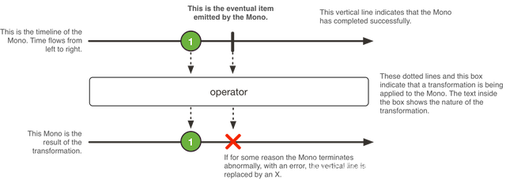
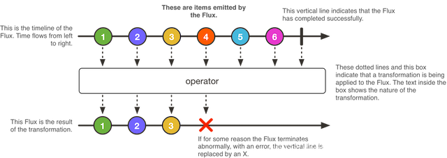

# 引言

随着互联网应用的复杂度不断增加，传统的请求响应模型已经无法满足日益增长的需求。 传统的Web应用使用Servlet容器，采用同步阻塞的方式来处理请求，请求需要等待相应的处理逻辑完成后才能返回结果。这种方式的缺点是很明显的，它会阻塞线程，导致资源的浪费，同时也限制了应用的并发处理能力。

# 什么是 WebFlux？

WebFlux 是 Spring Framework 5 中引入的一种新的响应式编程模型，它基于 Reactor 库，可以提供异步非阻塞的方式来处理请求，从而提高应用程序的性能和可伸缩性。 WebFlux 实现了 Reactive Streams 规范，可以与其他实现了该规范的库进行交互，例如 Reactor 和 RxJava。 相比传统的 Web 应用，WebFlux 可以提供更高的吞吐量和更低的延迟，同时也可以提高应用程序的可伸缩性和容错性。 WebFlux 还提供了一些有用的功能，例如响应式数据访问、响应式 Web 安全性、响应式 Web 客户端等。

一般来说，Spring MVC 用于同步处理，Spring Webflux 用于异步处理。

其实在servlet3.1提供了非阻塞的API，WebFlux提供了一种比其更完美的解决方案。使用非阻塞的方式可以利用较小的线程或硬件资源来处理并发进而提高其可伸缩性。

# WebFlux 特性

Reactor 框架是 Spring Boot Webflux 响应库依赖，通过 Reactive Streams 并与其他响应库交互。提供了两种响应式 API: Mono 和 Flux。一般是将 Publisher 作为输入，在框架内部转换成 Reactor 类型并处理逻辑，然后返回 Flux 或 Mono 作为输出。

## Mono

Mono 是响应流 Publisher ，即要么成功发布元素，要么错误:

## Flux

Flux 是响应流 Publisher，即要么成功发布 0 到 N 个元素，要么错误。Flux 其实是 Mono 的一个补充。

所以要注意：如果知道 Publisher 是 0 或 1 个，则用 Mono。

## 适用场景

Mono 和 Flux 适用于两个场景，即：

- Mono：实现发布者，并返回 0 或 1 个元素，即单对象
- Flux：实现发布者，并返回 N 个元素，即 List 列表对象

有人会问，这为啥不直接返回对象，比如返回 Entity/Long/List。原因是，直接使用 Flux 和 Mono 是非阻塞写法，相当于回调方式。利用函数式可以减少了回调，因此会看不到相关接口。反应了是 WebFlux 的好处：集合了非阻塞 + 异步。

微服务体系结构，WebFlux 和 MVC 可以混合使用。尤其开发 IO 密集型服务的时候，选择 WebFlux 去实现。

# WebMvc vs WebFlux

https://dzone.com/articles/raw-performance-numbers-spring-boot-2-webflux-vs-s?fileGuid=xxQTRXtVcqtHK6j8

# ？

springboot-webFlux webclient
